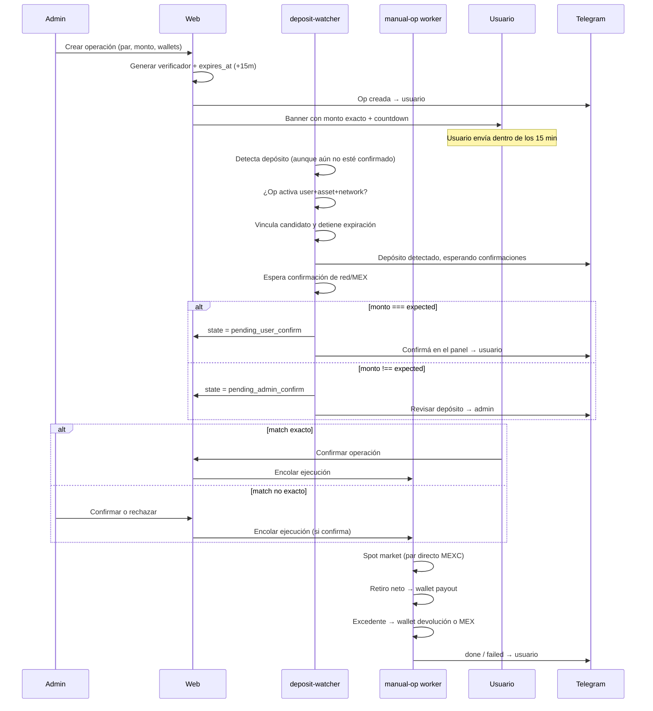

# Operaciones manuales — Especificación de implementación

> Documento de diseño para revisión. Resume todas las decisiones acordadas y el plan
> detallado de implementación en Robobounce v2.

---

## 1. Resumen

Las **operaciones manuales** permiten a un admin crear una orden ad-hoc para un usuario:
el cliente deposita un monto exacto (con código verificador de dos dígitos), el sistema
matchea el depósito sin pasar por las reglas de bounce, y tras confirmación ejecuta
conversión spot + retiro a la wallet de destino.

Características clave:

- Par seleccionable en ambas direcciones: **CRIPTO ↔ USDT / USDC** (asset + network en ambos lados).
- **Dígito verificador**: código `00`–`99` agregado en una escala fija por activo,
  usando el menor incremento operativo definido para ese activo (no siempre centésimas).
- **Timer de 15 minutos** desde la creación; al vencer expira (con botón de extender = nueva operación).
- **Una operación activa por usuario** a la vez.
- **Sin reglas de bounce**: wallets explícitas al crear (payout obligatoria, devolución opcional unificada).
- **Gate anti-bounce**: mientras hay operación activa para un activo/red, no se encola bounce automático.
- **Banner global** en todo el panel con countdown y estado.
- **Telegram** en cada paso relevante.
- Alcance v1: únicamente los activos y redes definidos en `ASSETS` / `SUPPORTED_PAIRS`
  (`USDT`, `USDC`, `BTC`, `ETH`, `TRX`). Soportar cualquier activo listado por MEXC
  requiere un proyecto posterior de catálogo, redes, fees y validación dinámica.

---

## 2. Roles y permisos

| Acción | Admin | Usuario (cliente) |
|--------|:-----:|:-----------------:|
| Crear operación | ✅ | ❌ |
| Extender (= crear nueva) | ✅ | ❌ |
| Cancelar operación | ✅ | ❌ |
| Confirmar match **exacto** | ❌ | ✅ |
| Confirmar match **no exacto** | ✅ | ❌ |
| Ver banner / detalle de su operación | ✅ (todos los users) | ✅ (propia) |
| Ver listado global de ops manuales | ✅ | ❌ |

v1: **solo admin crea**. El usuario solo confirma cuando el monto matchea exactamente.

Como estas acciones disparan movimientos de fondos, crear, confirmar mismatch,
rechazar/devolver y liberar candidatos al bounce requieren admin con 2FA habilitado y
un desafío TOTP reciente (step-up), no solamente sesión con `role='admin'`.
Cada server action relee `users.role/status` y `admin_2fa.enabled` desde DB; no confía
solamente en claims potencialmente viejos del JWT. Las transiciones de usuario incluyen
`WHERE user_id=session.user.id AND state='pending_user_confirm'`.

---

## 3. Flujo end-to-end



---

## 4. Máquina de estados

### 4.1 Estados

| Estado | Descripción |
|--------|-------------|
| `awaiting_deposit` | Operación creada, esperando que MEX detecte un depósito dentro de los 15 min |
| `awaiting_deposit_confirmation` | Hay candidatos detectados a tiempo; esperando confirmación de red/MEX |
| `pending_user_confirm` | Llegó depósito con monto **exacto**; usuario debe confirmar |
| `pending_admin_confirm` | Llegó depósito con monto **distinto**; admin debe confirmar o rechazar |
| `pending_candidate_resolution` | Payout principal terminado, pero quedan candidatos no seleccionados por resolver |
| `converting` | Preparando/enviando la orden spot |
| `awaiting_conversion` | Orden spot enviada; esperando fill y cantidades reales |
| `withdrawing` | Preparando el retiro principal |
| `awaiting_withdrawal` | Retiro principal enviado; esperando confirmación MEX/on-chain |
| `refunding` | Preparando devolución/excedente |
| `awaiting_refund` | Devolución enviada; esperando confirmación |
| `on_hold` | Ejecución pausada por condición recuperable; requiere retry/cancel admin |
| `done` | Completada exitosamente |
| `failed` | Error terminal únicamente después de reconciliar que no quedan efectos/fondos sin resolver |
| `expired` | Timer venció sin depósito matcheado |
| `cancelled` | Cancelada sin fondos pendientes, o después de completar/omitir devolución |

### 4.2 Transiciones

```
awaiting_deposit
  ├─ depósito detectado     → awaiting_deposit_confirmation
  ├─ timer vence            → expired
  └─ admin cancela          → cancelled

awaiting_deposit_confirmation
  ├─ candidato exacto confirmado    → pending_user_confirm
  ├─ candidato no exacto confirmado → pending_admin_confirm
  └─ admin cancela                  → refunding o cancelled

pending_user_confirm
  ├─ usuario confirma       → converting o withdrawing
  └─ admin cancela          → refunding o cancelled

pending_admin_confirm
  ├─ admin confirma monto a ejecutar → converting o withdrawing
  ├─ admin rechaza                   → refunding o cancelled
  └─ admin cancela                   → refunding o cancelled

converting → awaiting_conversion → withdrawing → awaiting_withdrawal
awaiting_withdrawal
  ├─ payout confirmado y hay refund → refunding → awaiting_refund
  └─ payout confirmado sin refund   → cierre

cierre
  ├─ hay candidatos sin resolver → pending_candidate_resolution → done
  └─ no hay candidatos abiertos → done

cualquier estado de ejecución
  └─ error recuperable → on_hold → retry al estado seguro persistido

expired / cancelled / done / failed → terminal
```

### 4.3 Timer (15 minutos)

- Se setea `expires_at = created_at + 15 minutes` al crear.
- Un **cron/ticker en el worker** (cada ~30s) marca `awaiting_deposit → expired` cuando `now > expires_at`.
- La fecha que determina si llegó a tiempo es `MEX deposit.insertTime`, persistida como
  `source_inserted_at`; no se usa la hora de confirmación.
- Al detectar un candidato cuyo `insertTime <= expires_at`, se lo vincula y se pasa a
  `awaiting_deposit_confirmation`; desde ese momento el timer deja de correr.
- Matcher y expiry worker compiten mediante un `UPDATE ... WHERE state =
  'awaiting_deposit'` atómico dentro de una transacción. Todas las queries de matching
  verifican también `expires_at`; el cron no es la única fuente de verdad.
- **`pending_*` NO expira automáticamente**: si llegó un depósito, la confirmación puede hacerse después del timer.
- **Extender** está disponible únicamente para una operación `expired` sin candidatos.
  Crea una **operación nueva** (nuevo verificador, nuevo timer); no reactiva la anterior.
- Los estados pendientes generan recordatorios al admin hasta resolverse.
- A los 30 minutos en `pending_*` se envía recordatorio; a las 2 horas se escala como
  alerta operativa. No se ejecuta, cancela ni libera fondos automáticamente.

### 4.4 Una operación activa por usuario

Estados que bloquean crear otra operación para el mismo `user_id`:

```
awaiting_deposit | awaiting_deposit_confirmation | pending_user_confirm |
pending_admin_confirm | pending_candidate_resolution | converting | awaiting_conversion | withdrawing |
awaiting_withdrawal | refunding | awaiting_refund | on_hold
```

Constraint parcial en DB (ver sección 5).

### 4.5 Exclusión financiera por cuenta MEX

El gate de depósitos no alcanza: sweep cron, manual sweep y bounces existentes consumen
el mismo balance libre. Para v1 se usa una exclusión conservadora por `mex_account_id`:

- al crear, rechazar si existen bounce jobs, conversiones, withdrawals o sweeps en vuelo
  para esa cuenta;
- una operación manual no terminal actúa como lock financiero de la cuenta;
- `bounce-engine`, `sweep-cron` y `manual-sweep` consultan ese lock antes de cualquier
  orden/retiro y quedan en espera sin consumir fondos;
- deposit-watcher puede seguir detectando y encolando otros depósitos, pero su ejecución
  espera a que se libere el lock;
- `on_hold` conserva el lock; `failed` solo puede ser terminal si reconciliation confirma
  que no quedan efectos externos ni fondos reservados sin resolver.

Todas las reservas y el claim del lock se realizan en transacción. Una futura versión
puede reemplazar esta exclusión por reservas contables por activo.

---

## 5. Schema de base de datos

### 5.1 Tabla `manual_operations`

Nueva migración `packages/db/drizzle/0005_manual_operations.sql`.

```sql
CREATE TABLE manual_operations (
  id                    UUID PRIMARY KEY DEFAULT gen_random_uuid(),
  user_id               UUID NOT NULL REFERENCES users(id) ON DELETE CASCADE,
  mex_account_id        UUID NOT NULL REFERENCES mex_accounts(id) ON DELETE RESTRICT,
  created_by_admin_id   UUID NOT NULL REFERENCES users(id),

  -- Par de entrada (lo que el usuario deposita)
  from_asset            TEXT NOT NULL,
  from_network          TEXT NOT NULL,

  -- Par de salida (lo que recibe)
  to_asset              TEXT NOT NULL,
  to_network            TEXT NOT NULL,

  -- Montos
  nominal_amount        NUMERIC(20, 8) NOT NULL,  -- lo que pidió el admin (ej. 0.5)
  verifier_digits       CHAR(2) NOT NULL,          -- '00'..'99'
  expected_deposit_amount NUMERIC(20, 8) NOT NULL, -- nominal + incremento verificador
  estimated_output      NUMERIC(20, 8),            -- snapshot informativo al crear

  -- Montos reales (post-depósito / post-ejecución)
  received_amount       NUMERIC(20, 8),            -- suma seleccionada para esta operación
  amount_to_execute     NUMERIC(20, 8),            -- monto aprobado para convertir/retirar
  converted_amount_gross NUMERIC(20, 8),           -- output real antes de deducciones
  executed_output       NUMERIC(20, 8),            -- monto neto retirado al payout
  surplus_amount        NUMERIC(20, 8),            -- excedente en activo de entrada
  surplus_asset         TEXT,
  average_fill_price    NUMERIC(30, 12),
  confirmation_quote    NUMERIC(30, 12),
  confirmation_quote_at TIMESTAMPTZ,
  max_slippage_bps      INTEGER NOT NULL DEFAULT 200,
  mex_trading_commission NUMERIC(20, 8),
  mex_commission_asset  TEXT,
  user_commission_amount NUMERIC(20, 8),
  platform_commission_amount NUMERIC(20, 8),
  payout_network_fee    NUMERIC(20, 8),
  refund_network_fee    NUMERIC(20, 8),

  -- Wallets + snapshot inmutable usado al ejecutar
  payout_wallet_id      UUID NOT NULL REFERENCES destination_wallets(id),
  payout_address        TEXT NOT NULL,
  payout_memo           TEXT,
  refund_wallet_id      UUID REFERENCES destination_wallets(id),
  refund_address        TEXT,
  refund_memo           TEXT,

  -- Spot (cache al ejecutar)
  spot_symbol           TEXT,                      -- ej. BTCUSDC
  spot_side             TEXT,                      -- BUY | SELL
  conversion_order_id   TEXT,

  -- Lifecycle
  state                 TEXT NOT NULL DEFAULT 'awaiting_deposit',
  resume_state          TEXT, -- estado seguro al que vuelve un retry desde on_hold
  reject_reason         TEXT,
  last_error            TEXT,
  internal_notes        TEXT,
  retry_count           INTEGER NOT NULL DEFAULT 0,
  version               INTEGER NOT NULL DEFAULT 0,
  locked_by             TEXT,
  locked_at             TIMESTAMPTZ,

  expires_at            TIMESTAMPTZ NOT NULL,
  confirmed_at          TIMESTAMPTZ,
  executed_at           TIMESTAMPTZ,
  completed_at          TIMESTAMPTZ,

  created_at            TIMESTAMPTZ NOT NULL DEFAULT now(),
  updated_at            TIMESTAMPTZ NOT NULL DEFAULT now(),
  CHECK (nominal_amount > 0),
  CHECK (expected_deposit_amount > 0),
  CHECK (verifier_digits ~ '^[0-9]{2}$'),
  CHECK (spot_side IS NULL OR spot_side IN ('BUY', 'SELL')),
  CHECK (state IN (
    'awaiting_deposit', 'awaiting_deposit_confirmation',
    'pending_user_confirm', 'pending_admin_confirm', 'pending_candidate_resolution',
    'converting', 'awaiting_conversion',
    'withdrawing', 'awaiting_withdrawal',
    'refunding', 'awaiting_refund', 'on_hold',
    'done', 'failed', 'expired', 'cancelled'
  ))
);

-- Solo una op activa por usuario
CREATE UNIQUE INDEX manual_ops_one_active_per_user
  ON manual_operations (user_id)
  WHERE state IN (
    'awaiting_deposit',
    'awaiting_deposit_confirmation',
    'pending_user_confirm',
    'pending_admin_confirm',
    'pending_candidate_resolution',
    'converting',
    'awaiting_conversion',
    'withdrawing',
    'awaiting_withdrawal',
    'refunding',
    'awaiting_refund',
    'on_hold'
  );

CREATE UNIQUE INDEX manual_ops_one_active_per_mex_account
  ON manual_operations (mex_account_id)
  WHERE state IN (
    'awaiting_deposit', 'awaiting_deposit_confirmation',
    'pending_user_confirm', 'pending_admin_confirm',
    'pending_candidate_resolution', 'converting', 'awaiting_conversion',
    'withdrawing', 'awaiting_withdrawal', 'refunding', 'awaiting_refund', 'on_hold'
  );

-- Match rápido por monto esperado (solo ops awaiting)
CREATE INDEX manual_ops_awaiting_match_idx
  ON manual_operations (user_id, from_asset, from_network, expected_deposit_amount)
  WHERE state = 'awaiting_deposit';

CREATE INDEX manual_ops_state_idx ON manual_operations (state, expires_at);
CREATE INDEX manual_ops_worker_idx ON manual_operations (state, locked_at, created_at);
CREATE INDEX manual_ops_user_idx ON manual_operations (user_id, created_at DESC);
```

### 5.2 Tabla `manual_operation_deposits`

Una operación puede recibir varios depósitos candidatos. No se agregan FKs en ambas
direcciones entre `deposits` y `manual_operations`, para evitar referencias circulares
e inconsistencias.

```sql
CREATE TABLE manual_operation_deposits (
  id                    UUID PRIMARY KEY DEFAULT gen_random_uuid(),
  manual_operation_id   UUID NOT NULL REFERENCES manual_operations(id) ON DELETE CASCADE,
  deposit_id            UUID NOT NULL REFERENCES deposits(id) ON DELETE RESTRICT,
  match_type            TEXT NOT NULL, -- exact | mismatch
  status                TEXT NOT NULL DEFAULT 'candidate',
  source_amount_raw     TEXT NOT NULL, -- representación exacta recibida de MEX
  source_inserted_at    TIMESTAMPTZ NOT NULL, -- MEX insertTime
  created_at            TIMESTAMPTZ NOT NULL DEFAULT now(),
  updated_at            TIMESTAMPTZ NOT NULL DEFAULT now(),
  UNIQUE (deposit_id),
  CHECK (match_type IN ('exact', 'mismatch')),
  CHECK (status IN (
    'candidate', 'selected', 'rejected', 'refunded', 'released_to_bounce'
  ))
);

CREATE UNIQUE INDEX manual_op_one_selected_deposit
  ON manual_operation_deposits (manual_operation_id)
  WHERE status = 'selected';

CREATE INDEX manual_op_deposit_candidates_idx
  ON manual_operation_deposits (manual_operation_id, status, created_at);
```

Todo depósito candidato queda trazado y **no** crea `bounce_job`. Un match exacto
confirmado tiene prioridad para selección; los demás quedan visibles para revisión.
Al cerrar la operación, cada candidato no seleccionado debe resolverse explícitamente:
rechazo/devolución, selección manual o liberación controlada al bounce mediante un
dispatcher que cree el `bounce_job` faltante.

### 5.3 Cambios en tablas existentes

**`deposits`**: conservar el valor original además del `NUMERIC(20,8)` histórico:

```sql
ALTER TABLE deposits ADD COLUMN amount_raw TEXT;
```

Los nuevos matches usan `amount_raw` + decimal exacto y precisión del activo. No usan
`Number`; `amount` se mantiene para compatibilidad con el bounce existente.

**`withdrawals.type`**: extender enum de dominio con:

```
manual_operation_payout   -- retiro principal post-conversión
manual_operation_refund   -- devolución de excedente o rechazo
```

Agregar a `withdrawals`:

```sql
ALTER TABLE withdrawals
  ADD COLUMN manual_operation_id UUID REFERENCES manual_operations(id) ON DELETE SET NULL;

CREATE INDEX withdrawals_manual_operation_idx
  ON withdrawals (manual_operation_id, type, status);
```

Este FK permite que reconciliation avance `awaiting_withdrawal` /
`awaiting_refund` sin depender de `bounce_job_id`.

**`operations.type`** (tracing): agregar `manual_operation`.

**`telegram_messages`**: agregar `dedupe_key TEXT` con índice unique parcial para
eventos de operaciones manuales. La clave contiene operación + evento + versión de
transición.

### 5.4 Drizzle schema

Nuevo archivo `packages/db/src/schema/manual-operations.ts`, exportar desde
`packages/db/src/schema/index.ts` y `packages/db/src/index.ts`. Generar migración,
journal y snapshot con Drizzle; `0005` es el nombre esperado hoy, no una suposición fija.

Constantes de estado en `packages/domain/src/states.ts`:

```typescript
export const MANUAL_OPERATION_STATES = [
  'awaiting_deposit',
  'awaiting_deposit_confirmation',
  'pending_user_confirm',
  'pending_admin_confirm',
  'pending_candidate_resolution',
  'converting',
  'awaiting_conversion',
  'withdrawing',
  'awaiting_withdrawal',
  'refunding',
  'awaiting_refund',
  'on_hold',
  'done',
  'failed',
  'expired',
  'cancelled',
] as const;
```

---

## 6. Dígito verificador

### 6.1 Generación

Al crear la operación:

1. Admin ingresa `nominal_amount` (ej. `0.5`, `100`, `5000`).
2. Sistema genera `verifier_digits` aleatorio `01`–`99`.
3. Calcula `expected_deposit_amount` según precisión del activo de entrada.

### 6.2 Fórmula por activo

| Activo | Precisión display | Fórmula | Ejemplo nominal → expected |
|--------|-------------------|---------|----------------------------|
| USDT, USDC | 2 decimales | `nominal + verifier × 10^-2` | `100.00` + `47` → **100.47** |
| BTC | 8 decimales | `nominal + verifier × 10^-8` | `0.50000000` + `23` → **0.50000023** |
| ETH | 8 decimales | `nominal + verifier × 10^-8` | `1.00000000` + `08` → **1.00000008** |
| TRX | 4 decimales | `nominal + verifier × 10^-4` | `1000.0000` + `55` → **1000.0055** |

La escala es una constante de dominio por activo y debe validarse contra la precisión
que MEX reporta para depósitos. El código nunca se calcula con `number`; se usa decimal
exacto/string para evitar errores binarios.

El monto ejecutado por defecto es `nominal_amount`. El incremento verificador forma
parte del `surplus`: se devuelve junto con cualquier excedente si supera mínimo + fee;
de lo contrario queda en la cuenta MEX.

Implementar `buildExpectedDepositAmount(nominal, verifier, asset)` como función pura
en `packages/domain/src/manual-operation.ts`, con tests unitarios.

**Importante**: el match normaliza ambos valores a decimal de 8 posiciones y compara
el valor exacto; no usa tolerancia ni `number` de JavaScript.

### 6.3 Colisiones

- Con 99 valores posibles, una sola operación activa por usuario y TTL de 15 min,
  la colisión es rara.
- Si al generar el verificador ya existe `(user_id, from_asset, from_network, expected_deposit_amount)`
  en otra op `awaiting_deposit`, reintentar con otro dígito (máx. 10 intentos).
- Constraint unique parcial opcional en `(user_id, from_asset, from_network, expected_deposit_amount)
  WHERE state = 'awaiting_deposit'`.
- El matcher exige `created_at <= source_inserted_at <= expires_at`, evitando que un
  depósito viejo reclame una operación nueva.
- Al generar, no reutilizar el mismo `expected_deposit_amount` para user+asset+network
  dentro de una ventana histórica configurable (default 24h). Esto cubre reportes
  tardíos o timestamps inconsistentes de MEX.

---

## 7. Resolución de par spot MEXC

Reemplazar la lógica limitada de `pickSpotSymbol` (solo USDT) por resolución genérica.
La lista siguiente es informativa, no un catálogo hardcodeado.

### 7.1 Pares directos confirmados en MEXC (entre nuestros activos)

```
BTC/USDC   ETH/USDC   TRX/USDC
BTC/USDT   ETH/USDT   TRX/USDT
ETH/BTC    TRX/BTC
USDC/USDT
```

El formulario v1 permite pares donde al menos un lado es `USDT` o `USDC`
(incluye USDT↔USDC). No expone CRIPTO↔CRIPTO aunque MEX tenga el mercado.

### 7.2 Algoritmo de resolución de par

```
1. Si from === to → null (solo cambio de red, sin conversión)
2. Probar symbol = from + to  → side SELL (vendo base = from)
3. Si no existe en exchangeInfo, probar symbol = to + from → side BUY (compro base = to, pago with from)
4. Si ninguno → error al crear / on_hold al ejecutar
```

La generación de símbolos candidatos puede ser pura, pero la disponibilidad se consulta
en MEX con `getSymbolInfo`. No se debe hardcodear que un par existe.

```typescript
export interface SpotPairResolution {
  symbol: string;       // ej. BTCUSDC
  side: 'BUY' | 'SELL';
  baseAsset: Asset;
  quoteAsset: Asset;
}

export function candidateSpotPairs(from: Asset, to: Asset): SpotPairResolution[];
```

Un servicio async prueba los candidatos contra `exchangeInfo`, incluyendo `status` y
reglas de precisión. Se valida al **crear** (fail fast) y nuevamente al **ejecutar**,
porque MEX puede suspender el par entre ambos momentos.
Corregir `MexClient.getSymbolInfo`: debe devolver solo una coincidencia exacta del
símbolo solicitado, nunca `symbols[0]` como fallback.
Reutilizar en bounce-engine (refactor posterior, fuera de scope v1 si complica).

### 7.3 Estimado de salida (informativo)

Al crear, calcular snapshot:

- **SELL** (CRIPTO → stable): `nominal × bid × (1 - comisiones)` − fee red estimado
- **BUY** (stable → CRIPTO): `nominal / ask × (1 - comisiones)` − fee red estimado
- **Sin conversión** (mismo asset, distinta red): `nominal − comisiones − fee`

Usar `fetchBookTickers` + `getUserCommission` + `getPlatformCommission` + fee de red seed/live.
Guardar en `estimated_output`; el activo ya está definido por `to_asset`. **No congela tipo de cambio.**

La ejecución usa **market order al TC del momento**.

### 7.4 Protección de precio y comisión real MEX

- Al mostrar confirmación se obtiene una cotización nueva; el usuario/admin confirma
  esa cotización, su timestamp y `max_slippage_bps` (default 200 = 2%).
- La cotización no puede tener más de 30 segundos al confirmar.
- Antes de enviar la orden, el worker vuelve a cotizar. Si el desvío supera el límite,
  pasa a `on_hold` sin ejecutar.
- Una vez enviada una market order no se intenta revertirla.
- Solo `FILLED` es terminal exitoso; `PARTIALLY_FILLED` permanece esperando o termina
  en `on_hold` al expirar/cancelarse la orden.
- Extender `@rb/mex-client` con consulta de trades/fills (`myTrades`) para persistir
  comisión real y `commissionAsset`. `executedQty`/`cummulativeQuoteQty` por sí solos
  no garantizan el saldo neto retirable.

---

## 8. Cambios en deposit-watcher

Archivo: `apps/worker/src/deposit-watcher.ts`

### 8.1 Hook pre-bounce

Antes de `maybeEnqueueBounce`, llamar a `tryMatchManualOperation(db, userId, deposit)`.

```typescript
async function tryMatchManualOperation(
  db: Database,
  userId: string,
  dep: Deposit,
  sourceInsertedAt: Date,
): Promise<
  | { action: 'none' }
  | { action: 'candidate'; opId: string; exact: boolean }
  | { action: 'blocked'; opId: string }
>
```

### 8.2 Lógica de matching

```
1. Buscar la única op no terminal del user para from_asset + from_network.
2. Si no existe:
   → action: none (bounce tradicional).
3. Si state=awaiting_deposit:
   - Si sourceInsertedAt > expires_at:
     → no matchear; expiry gana.
   - Si llegó a tiempo:
     → transacción con lock/compare-and-set.
     → insertar manual_operation_deposits (exact o mismatch).
     → state=awaiting_deposit_confirmation si MEX aún no confirmó.
4. Cuando MEX confirma un candidato:
   - Si hay candidato exacto confirmado:
     → seleccionarlo, state=pending_user_confirm.
   - Si solo hay mismatch confirmado:
     → state=pending_admin_confirm; admin ve todos los candidatos.
5. Si la op ya está en estado no terminal:
   → registrar cada depósito adicional como candidato; nunca descartarlo en silencio.
```

### 8.3 Gate anti-bounce

Si `action !== 'none'`, **no llamar** `maybeEnqueueBounce`. La inserción del candidato
y el cambio de estado ocurren atómicamente; una restricción única en `deposit_id`
evita procesarlo dos veces.

Esto evita que un depósito de más (o cualquier depósito mientras hay op activa) caiga
al bounce tradicional con reglas de ruteo.

**Post-expiración** (`expired` / `cancelled` / `done` / `failed`): depósitos nuevos van
al bounce normal. Los candidatos ya interceptados no se liberan implícitamente: el admin
debe seleccionarlos, devolverlos o liberarlos al bounce. Un dispatcher de liberación
crea el `bounce_job` porque el watcher no vuelve a procesar depósitos ya confirmados.

### 8.4 Expiración automática

Nuevo loop en worker: `apps/worker/src/manual-operation-expiry.ts`

```
Cada 30s:
  UPDATE manual_operations
  SET state = 'expired', updated_at = now()
  WHERE state = 'awaiting_deposit' AND expires_at < now()
  → notify telegram usuario + audit log
```

El `UPDATE` retorna las filas cambiadas para notificar una sola vez. No expira operaciones
con candidatos detectados a tiempo, aunque todavía estén esperando confirmaciones.

---

## 9. Worker de ejecución

Nuevo archivo: `apps/worker/src/manual-operation-engine.ts`

Registrar en `apps/worker/src/index.ts` junto a los demás loops.

### 9.1 Disparador

La ejecución arranca cuando la operación pasa a su primer estado de ejecución:

- Usuario confirma (`pending_user_confirm → converting|withdrawing`)
- Admin confirma con `amount_to_execute` (`pending_admin_confirm → converting|withdrawing`)

Las acciones usan un `UPDATE ... WHERE state = <estado esperado>` para evitar doble
confirmación. No se permite cancelar una operación que ya inició conversión/retiro.

El worker reclama cada operación con lease (`locked_by`, `locked_at`, `version`) como
el bounce engine. Un lease vencido puede retomarse; dos instancias nunca ejecutan el
mismo paso en paralelo.

### 9.2 Pasos de ejecución

```
1. Cargar op + candidatos seleccionados + snapshots de wallets + mex_account activo
2. Determinar `amount_to_execute`:
   - Match exacto: nominal_amount
   - Match no exacto: valor ingresado explícitamente por admin
   - Validar 0 < amount_to_execute <= received_amount
   - surplus = received_amount - amount_to_execute
3. Si from_asset !== to_asset:
   a. Volver a resolver/verificar par spot en MEX
   b. Market order (reutilizar lógica de bounce-engine handleConverting)
   c. Guardar conversion_order_id
4. Esperar estado terminal `FILLED`, consultar fills/trades y tomar output neto real:
   - SELL: cummulativeQuoteQty
   - BUY: executedQty
   - restar/registrar comisión MEX según commissionAsset
5. Calcular neto post-comisión sobre el activo de salida
6. Crear retiro principal usando snapshot payout (manual_operation_payout)
7. Esperar confirmación del retiro mediante reconciliation
8. Resolver surplus:
   - con refund_wallet compatible y surplus > withdrawMin + withdrawFee:
     crear manual_operation_refund, descontando fee del monto recibido
   - sin wallet o debajo del mínimo: dejar en MEX y registrar motivo
9. Si quedan candidatos no seleccionados: state=pending_candidate_resolution
10. state=done solo cuando payout/refund requerido estén confirmados y todos los
    candidatos estén seleccionados, rechazados, devueltos o liberados al bounce
```

### 9.3 Idempotencia

- `conversionOrderId`: `mc-{uuidSinGuionesTruncado}`
- `payoutWithdrawOrderId`: `mp-{uuidSinGuionesTruncado}`
- `refundWithdrawOrderId`: `mr-{uuidSinGuionesTruncado}`

Agregar helpers en `packages/domain/src/idempotency.ts`, siguiendo los límites actuales
de MEX: determinísticos, únicos y **máximo 32 caracteres**. Cubrir longitud, estabilidad
y separación entre legs con tests.

Cada paso persiste estado antes de llamar a MEX. Ante dedup se recupera la orden por
`clientOrderId` / `withdrawOrderId`. `reconciliation.ts` debe reconocer ambos nuevos
tipos de withdrawal y avanzar la operación manual correspondiente; no alcanza con el
comportamiento actual, que solo completa `bounce_jobs`.

### 9.4 Rechazo (admin)

Cuando admin rechaza en `pending_admin_confirm`:

```
1. Guardar reject_reason
2. Si hay depósito recibido:
   - Con refund_wallet compatible y monto > mínimo+fee:
     state=refunding → awaiting_refund → cancelled
   - Sin refund_wallet o debajo del mínimo:
     fondos quedan en MEX → cancelled
3. La devolución descuenta su fee; nunca usa otros fondos de la cuenta.
4. notify telegram usuario
```

### 9.5 Underpayment — política acordada

**No pedir al usuario que envíe más fondos.** El verificador está atado al monto exacto;
un segundo depósito delta sería imposible de matchear de forma confiable.

| Situación | Acción |
|-----------|--------|
| Timer vence, nada llegó | `expired`. Admin usa "Extender" (= nueva op) |
| Llegó de menos | `pending_admin_confirm`. Admin ingresa `amount_to_execute` o rechaza |
| Llegó de más | `pending_admin_confirm`. Admin ingresa `amount_to_execute`; el resto es surplus |

---

## 10. UI — Web

### 10.1 Admin: crear operación

**Ubicación**: `/admin/users/[id]` → nuevo botón "Operación manual" (dialog).

**Campos**:

| Campo | Tipo | Requerido |
|-------|------|-----------|
| Usuario | pre-filled desde `[id]` | ✅ |
| Activo entrada | select ASSETS | ✅ |
| Red entrada | select NETWORKS filtrado | ✅ |
| Monto nominal | number | ✅ |
| Activo salida | select ASSETS | ✅ |
| Red salida | select NETWORKS filtrado | ✅ |
| Wallet payout | select wallets del user (filtrado to_asset/to_network) | ✅ |
| Wallet devolución | select wallets del user filtrado por from_asset/from_network | ❌ |
| Notas internas | textarea | ❌ |

Antes de habilitar el submit, el server valida:

- usuario aprobado con cuenta MEX activa;
- `from_asset/from_network` y `to_asset/to_network` soportados;
- al menos uno de los dos activos es `USDT` o `USDC`;
- existe dirección de depósito MEX con `status='ok'`;
- payout wallet pertenece al usuario y coincide con `to_asset/to_network`;
- refund wallet, si existe, pertenece al usuario y coincide con `from_asset/from_network`;
- el par spot directo está disponible, salvo operación del mismo activo;
- no existe otra operación activa.
- no hay maintenance global, usuario suspendido ni cuenta MEX deshabilitada.

Las operaciones manuales ignoran el pause voluntario del usuario/activo porque son una
instrucción explícita del admin, pero la UI muestra esa condición y exige confirmarla.
Maintenance, suspensión y cuenta MEX inactiva bloquean creación y ejecución.

La dirección, memo y asset/network de payout/refund se copian como snapshot inmutable.

**Preview en vivo** (client component):

- Verificador generado (server-side al submit; preview puede simular con placeholder)
- Monto exacto a depositar
- Estimado de salida (fetch `/api/admin/manual-operations/estimate` o server action)
- Par spot resuelto
- Dirección de depósito MEX + memo/tag, con botón copiar
- Validación: par existe, una op activa, wallets válidas

**Acciones post-creación**:

- Ver operación en detalle
- Extender (cancela/expira actual + abre form pre-filled)
- Cancelar

**Server actions** en `apps/web/app/(admin)/admin/users/[id]/manual-operation-actions.ts`:

```typescript
createManualOperationAction(userId, formData)
extendManualOperationAction(userId, previousOpId)
cancelManualOperationAction(opId)
confirmManualOperationAction(opId, { amountToExecute: string })  // admin
rejectManualOperationAction(opId, reason)
releaseCandidateToBounceAction(candidateId)
```

### 10.2 Admin: listado global

**Ubicación**: `/admin/manual-operations` (nuevo nav item) o tab en `/admin/operations`.

Tabla con filtros por estado:

| Columna | Contenido |
|---------|-----------|
| Usuario | email |
| Par | BTC/BTC → USDT/TRC20 |
| Expected | 0.50000023 BTC |
| Estado | badge |
| Expira | countdown o "—" |
| Acciones | Seleccionar candidato / Confirmar monto / Rechazar / Cancelar / Liberar a bounce / Ver |

Destacar filas `pending_admin_confirm` en amber.

### 10.3 Usuario: confirmar match exacto

**Ubicación**: `/operations` (nueva página) o sección en `/dashboard`.

Cuando `state = pending_user_confirm`:

```
┌─────────────────────────────────────────────────────┐
│ Depósito recibido — confirmá tu operación           │
│ Enviaste: 0.50000023 BTC                            │
│ Vas a recibir ≈ USDT (estimado al crear: X USDT)   │
│ Tipo de cambio: al momento de confirmar (market)   │
│                                                     │
│ [Confirmar operación]                               │
└─────────────────────────────────────────────────────┘
```

**Server action** en `apps/web/app/(user)/operations/actions.ts`:

```typescript
confirmManualOperationAction(opId)  // solo si pending_user_confirm y session.user.id = op.user_id
```

### 10.4 Banner global

Componente: `apps/web/components/open-operation-banner.tsx` (client, countdown).

**User layout** (`apps/web/app/(user)/layout.tsx`):

```tsx
<OpenOperationBanner initialOperation={activeOperation} />
{children}
```

**Admin layout**: banner compacto con ops `pending_admin_confirm` count + link a listado.

#### Variantes del banner

| Estado | User banner | Color |
|--------|-------------|-------|
| `awaiting_deposit` | "Depositá **0.50000023 BTC** (BTC) → USDT TRC20 · quedan **12:34**" | azul/neutral |
| `awaiting_deposit_confirmation` | "Depósito detectado — esperando confirmaciones de red" | azul/neutral |
| `pending_user_confirm` | "Depósito recibido — **confirmá** tu operación" | amber |
| `pending_admin_confirm` | "Depósito recibido con diferencia — revisión del admin" | amber |
| `pending_candidate_resolution` | (admin) "Hay depósitos adicionales por resolver" | amber |
| estados de ejecución | "Procesando tu operación… ({paso})" | neutral |

**Data fetching**:

- Server component wrapper en layout hace query inicial.
- Client poll cada 30s a `/api/user/manual-operations/active` (user) o
  `/api/admin/manual-operations/pending` (admin).
- Countdown calculado client-side desde `expires_at`.
- Al llegar a cero muestra "Verificando expiración…" y deshabilita acciones; nunca
  asume localmente que DB ya expiró. Todas las mutaciones vuelven a validar `expires_at`.

El banner aparece en todas las rutas autenticadas de usuario/admin. No se muestra en
login ni páginas públicas. Para `awaiting_deposit` incluye siempre dirección MEX,
memo/tag y botón copiar, además del monto exacto.

---

## 11. API routes

| Route | Método | Auth | Propósito |
|-------|--------|------|-----------|
| `/api/user/manual-operations/active` | GET | user | Op activa del usuario (para banner) |
| `/api/admin/manual-operations/estimate` | POST | admin | Preview estimado al crear |
| `/api/admin/manual-operations/pending` | GET | admin | Ops pending_admin_confirm (banner admin) |

Preferir server actions para mutaciones; routes solo para polling client-side.

---

## 12. Telegram

Extender `apps/worker/src/notifier.ts`:

### 12.1 Nuevos template keys

```typescript
| 'manual_op_created'
| 'manual_op_deposit_detected'
| 'manual_op_deposit_exact'
| 'manual_op_deposit_mismatch'
| 'manual_op_user_confirmed'
| 'manual_op_admin_confirmed'
| 'manual_op_rejected'
| 'manual_op_processing'
| 'manual_op_done'
| 'manual_op_failed'
| 'manual_op_on_hold'
| 'manual_op_candidate_resolution'
| 'manual_op_expired'
| 'manual_op_cancelled'
```

### 12.2 Mensajes (español)

| Evento | Destinatario | Texto (template) |
|--------|--------------|------------------|
| Creada | Usuario | "Operación creada: depositá **{expected} {asset} ({network})** a {address} {memo} en los próximos 15 min. Vas a recibir {to_asset} en {to_network}. Código: {verifier}" |
| Detectada | Usuario | "Detectamos tu depósito dentro del plazo. Esperando confirmaciones de red/MEX." |
| Depósito exacto | Usuario | "Recibimos {amount}. Confirmá la operación en el panel." |
| Depósito no exacto | Admin | "Depósito {amount} para op {id} (esperado {expected}). Revisar en admin." |
| Usuario confirmó | Usuario + Admin | "Operación confirmada, procesando…" |
| Admin confirmó | Usuario | "El admin confirmó tu operación. Procesando…" |
| Rechazada | Usuario | "Operación rechazada: {reason}. {refund_note}" |
| Done | Usuario | "Operación completada: {output} {asset} enviados a tu wallet." |
| Failed/on hold | Usuario | "La operación requiere revisión: {reason}. Estado de payout/refund: {funds_status}." |
| Expirada | Usuario | "Operación expirada. Contactá al admin si necesitás una nueva." |
| Cancelada | Usuario | "Operación cancelada por el admin." |

Para notificar admin en mismatch se usa un chatId de operaciones configurado en
`system_settings`; no se envía indiscriminadamente a todos los admins.

Actualmente `notifier.ts` vive dentro del worker. Crear/confirmar desde server actions
requiere extraer un helper compartido de outbox (por ejemplo en `@rb/db`/`@rb/domain`)
que inserte `telegram_messages` dentro de la misma transacción de estado. Agregar una
clave de deduplicación por `(manual_operation_id, event_type, transition_version)` para
que retries del worker no generen mensajes repetidos.

La migración de outbox agrega `attempt_count`, `next_attempt_at` y `dedupe_key`. El bot
reintenta filas `sent_ok IS NULL OR sent_ok=false` con backoff. Los mensajes se envían
como texto plano (sin asumir Markdown `parse_mode`). Agregar `manual_ops_admin_chat_id`
a los system settings tipados.

---

## 13. Wallet de devolución unificada

Un solo campo opcional `refund_wallet_id` que cubre:

| Caso | Comportamiento |
|------|----------------|
| Excedente en activo de entrada | Retiro del surplus menos fee a refund_wallet compatible |
| Rechazo con fondos ya recibidos | Retiro del received_amount menos fee a refund_wallet compatible |
| Falla post-depósito pre-retiro | Manual según RUNBOOK; refund_wallet si aplica |
| Sin refund_wallet | Fondos quedan en cuenta MEX del usuario |

La refund wallet debe pertenecer al mismo usuario y coincidir exactamente con
`from_asset/from_network`; de otro modo implicaría una segunda conversión no contemplada.
Validar `isValidAddress` y guardar snapshot. Si el monto no supera `withdrawMin +
withdrawFee` o no respeta `withdrawIntegerMultiple`, queda en MEX con trazabilidad.

---

## 14. Auditoría

Cada acción admin inserta en `audit_log`:

| action | payload |
|--------|---------|
| `manual_op_created` | opId, par, nominal, expected, wallets |
| `manual_op_extended` | oldOpId, newOpId |
| `manual_op_cancelled` | opId, reason |
| `manual_op_admin_confirmed` | opId, selectedDepositId, amountToExecute |
| `manual_op_rejected` | opId, reason |
| `manual_op_candidate_released` | opId, depositId, bounceJobId |

### 14.1 Contabilidad e historial

La operación debe aparecer en el historial del usuario y en observabilidad admin, no
solo en la pantalla nueva. Exponer:

- monto nominal, recibido y ejecutado;
- símbolo, side, fill promedio y output bruto real;
- comisión usuario, comisión plataforma y fees de payout/refund;
- wallet/tx del payout y refund;
- surplus devuelto o retenido en MEX;
- timeline de estados y errores.

Cada ejecución usa `runWithCorrelation(type='manual_operation')`. El comprobante
específico queda fuera de v1, pero los datos necesarios se guardan desde el inicio.

---

## 15. Archivos a crear / modificar

### 15.1 Nuevos

```
packages/db/drizzle/0005_manual_operations.sql
packages/db/src/schema/manual-operations.ts
packages/domain/src/manual-operation.ts          # buildExpectedDepositAmount, etc.
packages/domain/src/spot-pairs.ts                # candidateSpotPairs
packages/domain/src/manual-operation.test.ts
packages/domain/src/spot-pairs.test.ts

apps/worker/src/manual-operation-expiry.ts
apps/worker/src/manual-operation-engine.ts
apps/worker/src/manual-operation-match.ts        # tryMatchManualOperation
apps/worker/src/manual-operation-release.ts      # candidatos liberados al bounce

apps/web/app/(admin)/admin/manual-operations/page.tsx
apps/web/app/(admin)/admin/users/[id]/manual-operation-dialog.tsx
apps/web/app/(admin)/admin/users/[id]/manual-operation-actions.ts
apps/web/app/(user)/operations/page.tsx
apps/web/app/(user)/operations/actions.ts
apps/web/components/open-operation-banner.tsx
apps/web/app/api/user/manual-operations/active/route.ts
apps/web/app/api/admin/manual-operations/estimate/route.ts
apps/web/app/api/admin/manual-operations/pending/route.ts
```

### 15.2 Modificar

```
packages/domain/src/states.ts                    # MANUAL_OPERATION_STATES, WITHDRAWAL_TYPES
packages/domain/src/idempotency.ts               # mo-* order ids
packages/db/src/index.ts                         # export schema
packages/db/src/schema/index.ts                  # export schema
packages/mex-client/src/types.ts                 # trades/fills + comisión
packages/mex-client/src/client.ts                # myTrades

apps/worker/src/deposit-watcher.ts               # hook pre-bounce
apps/worker/src/index.ts                         # registrar loops
apps/worker/src/notifier.ts                      # templates telegram
apps/worker/src/reconciliation.ts                # completar payout/refund de manual op
apps/worker/src/sweep-cron.ts                    # respetar lock financiero
apps/worker/src/manual-sweep.ts                  # respetar lock financiero

apps/web/app/(user)/layout.tsx                   # banner
apps/web/app/(admin)/admin/layout.tsx            # banner + nav link
apps/web/app/(admin)/admin/users/[id]/page.tsx   # botón operación manual
apps/web/app/(admin)/admin/security/*            # step-up TOTP para acciones monetarias

apps/worker/src/bounce-engine.ts                 # (opcional v1.1) resolver genérico
docs/RUNBOOK.md                                  # sección operaciones manuales
```

---

## 16. Plan de implementación por fases

### Fase 1 — Fundación (domain + DB)

- [ ] Migración SQL + schema Drizzle
- [ ] `buildExpectedDepositAmount` + tests
- [ ] `candidateSpotPairs` + validación async MEX + tests
- [ ] Estados e idempotency keys
- [ ] Helper compartido de Telegram outbox con deduplicación
- [ ] Lock financiero por mex_account + validación de trabajo previo
- [ ] Endpoint MEX myTrades/fills y comisión real

### Fase 2 — Worker

- [ ] `manual-operation-match.ts` + integración deposit-watcher
- [ ] `manual-operation-expiry.ts`
- [ ] `manual-operation-engine.ts` (conversión + retiros)
- [ ] Reconciliation de payout/refund + liberación de candidatos
- [ ] Integrar lock en bounce, sweep cron y manual sweep
- [ ] Templates telegram

### Fase 3 — Admin UI

- [ ] Dialog crear operación en user detail
- [ ] Listado `/admin/manual-operations`
- [ ] Actions: create, extend, cancel, confirm amount, reject, release candidate
- [ ] Step-up TOTP para acciones monetarias
- [ ] API estimate

### Fase 4 — User UI

- [ ] Página `/operations` con confirmación
- [ ] Banner global en layout
- [ ] API active op

### Fase 5 — QA + docs

- [ ] Tests integración deposit-watcher matching
- [ ] Test e2e happy path (mock MEX)
- [ ] Actualizar RUNBOOK
- [ ] Probar Telegram en staging

---

## 17. Test plan

### Unitarios

- `buildExpectedDepositAmount` para USDT, BTC, ETH, TRX
- `candidateSpotPairs` para todas las combinaciones soportadas
- Colisión de verificador (reintento)
- Comparación decimal exacta de montos
- Verificador BTC `0.50000000 + 23 = 0.50000023`
- Validación de `amount_to_execute` y cálculo de surplus
- Refund mínimo/fee/integer multiple
- Expected reutilizado por depósito tardío → no matchea fuera de created_at/expires_at

### Integración

- Depósito detectado dentro del plazo y confirmado después → no expira
- Carrera matcher vs expiry → exactamente una transición gana
- Depósito exacto → `pending_user_confirm`, candidato seleccionado, no bounce_job
- Depósito no exacto → `pending_admin_confirm`, candidato visible, no bounce_job
- Mismatch seguido de exacto → ambos candidatos; exacto tiene prioridad
- Dos depósitos simultáneos → ambos trazados, ninguno se pierde
- Candidato liberado → se crea un único bounce_job
- Depósito post-expired → bounce normal
- Crash/retry en cada subestado → no duplica conversión ni retiro
- Sweep/manual sweep/bounce concurrente → respetan lock y no consumen reserva
- Par desaparece y slippage excedido → on_hold sin orden duplicada
- PARTIALLY_FILLED no se trata como conversión completa
- Comisión MEX en base/quote se descuenta del output correcto
- Confirmación → conversión/retiro/reconciliation → done
- Rechazo con/sin refund_wallet
- Excedente con/sin refund_wallet
- Wallet editada después de crear → se usa snapshot
- Usuario no puede confirmar op ajena; admin sin step-up no mueve fondos
- Outbox Telegram retry → un solo mensaje lógico por transición

### Manual (staging)

1. Admin crea op BTC→USDT para user de prueba
2. Verificar banner + telegram + monto expected
3. Simular depósito (o depositar testnet si disponible)
4. Usuario confirma → verificar retiro
5. Repetir con monto incorrecto → admin confirma/rechaza
6. Verificar que timer expira y libera gate

---

## 18. Decisiones cerradas (checklist)

| # | Decisión | Valor |
|---|----------|-------|
| 1 | Quién crea | Solo admin |
| 2 | Timer | 15 min hasta detección MEX; extender expired = nueva op |
| 3 | Match exacto | `pending_user_confirm` (usuario confirma) |
| 4 | Match no exacto | `pending_admin_confirm` |
| 5 | Ops simultáneas | Una por usuario |
| 6 | Par | asset + network ambos lados |
| 7 | Spot | Par directo MEXC (sin hop USDT) |
| 8 | Estimado | Informativo; ejecución a market |
| 9 | Underpayment | Admin decide; no pedir "enviá más" |
| 10 | Excedente / devolución | Wallet unificada opcional; si no, queda en MEX |
| 11 | Cancelación | Sí (admin) |
| 12 | Telegram | Cada paso |
| 13 | Banner | Global en todo el sitio |
| 14 | Anti-bounce gate | Activo mientras op no terminal |
| 15 | Verificador cripto | Últimas unidades de precisión, no 3er/4to decimal |
| 16 | Depósitos múltiples | Candidatos trazados; exacto confirmado tiene prioridad |
| 17 | Refund wallet | Debe coincidir con activo/red de entrada |
| 18 | Seguridad admin | Step-up TOTP para acciones monetarias |
| 19 | Alcance v1 | Solo activos/redes internos actualmente soportados |

---

## 19. Fuera de scope v1

- Usuario crea operaciones (self-service)
- Refactor de bounce-engine tradicional para usar el resolver genérico (v1.1)
- Catálogo dinámico de todos los activos/redes de MEXC
- Congelar tipo de cambio por 15 min
- Múltiples ops simultáneas por usuario
- Cross-pairs sin USDT/USDC (ej. BTC → ETH directo)
- Integración con comprobante / receipt existente (evaluar en v1.1)

---

## 20. Riesgos y mitigaciones

| Riesgo | Mitigación |
|--------|------------|
| Usuario deposita monto exacto pero en red incorrecta | No se atribuye a la op; sigue flujo bounce de esa red y se alerta al admin si el monto coincide. |
| MEXC deshabilita par spot | Validar al crear y ejecutar; `on_hold` con retry/cancel admin. |
| Depósito llega a tiempo pero confirma tarde | Usar `insertTime`; reservar candidato al detectarlo y detener timer. |
| Race matcher vs expiry | Compare-and-set transaccional; solo una transición puede ganar. |
| Dos depósitos simultáneos | Ambos se guardan como candidatos; ninguno se descarta ni rebota automáticamente. |
| Candidato bloqueado queda huérfano | Resolución explícita o dispatcher idempotente de liberación al bounce. |
| Verificador colisiona | Reintento automático + unique index parcial. |
| Admin no ve pending a tiempo | Banner admin + telegram + listado destacado. |
| Precisión MEX difiere de nuestra fórmula | Decimal exacto + escala por activo validada contra MEX + tests con montos reales. |
| Wallet editada mientras la op está abierta | Ejecutar únicamente contra snapshots de address/memo. |
| Crash entre conversión y retiro | Subestados persistentes, IDs determinísticos y reconciliation extendida. |
| Refund consume saldo ajeno | Fee se descuenta del refund; nunca se hace gross-up con otros fondos. |
| Sweep/bounce consume fondos reservados | Lock financiero exclusivo por mex_account en todos los workers monetarios. |
| Precio cambia entre confirmación y ejecución | Quote fresco, máximo 30s y slippage configurable; exceso → on_hold. |
| Fill parcial o comisión spot no observada | Esperar FILLED y consultar trades/comisión real antes de calcular payout. |
| JWT admin desactualizado | Revalidar role/status/2FA en DB y exigir step-up TOTP. |

---

*Última actualización: acordado en diseño colaborativo. Pendiente de revisión antes de implementar.*
